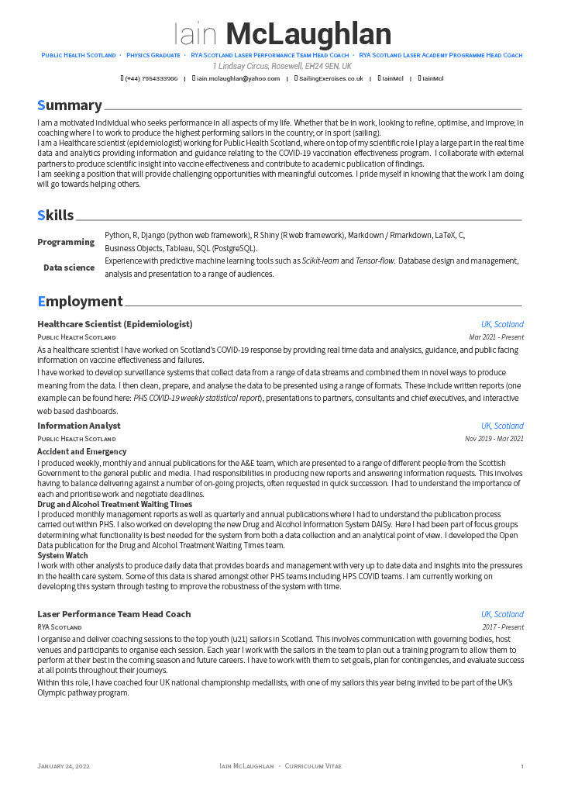
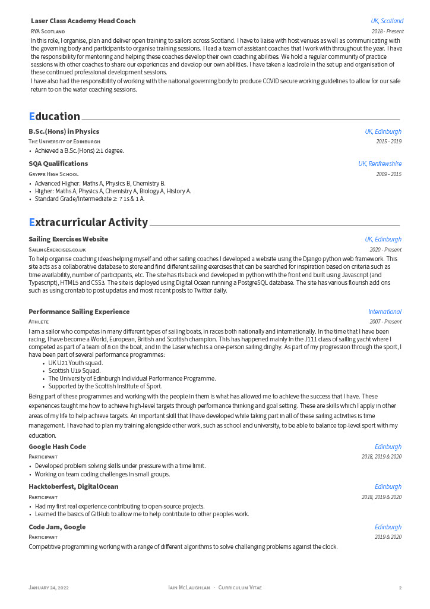

A pdf version of my cv can be found [here](./cv.pdf).

## New application

1. Create a folder in `Applications` for the new company/application
1. Copy `cv_template.tex` and `cover_letter_template.tex` to the new folder
1. Update `Summary` in cv
1. Update company details in cover letter

## Compilation

`xelatex cv.tex`
